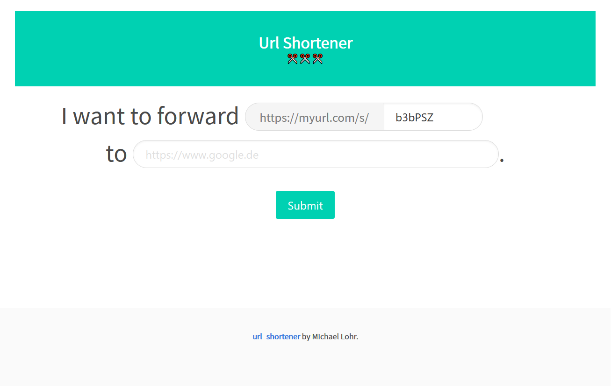

# URL Shortener

 

A dead-simple URL shortener written in [Rust](https://www.rust-lang.org/) using the Web framework [Rocket](https://rocket.rs/) and in-memory database [sled](http://sled.rs/); Styled using [https://bulma.io/](https://bulma.io/)

